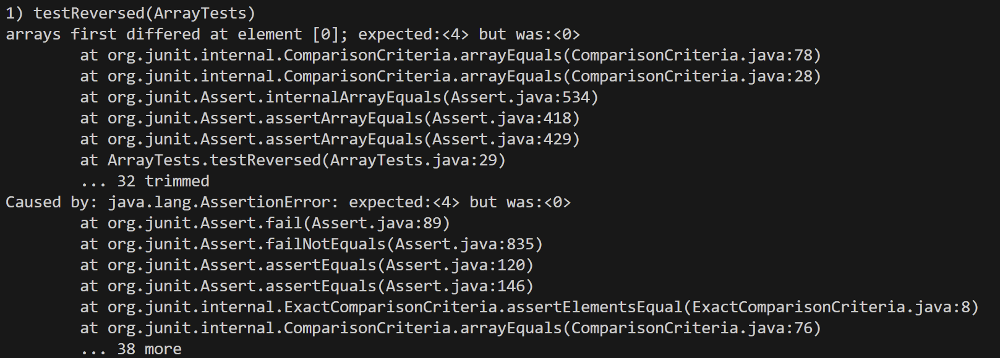

Name: **Richard Vo** 
PID: **A17907078**

# Lab Report Week 5

## Part 1
```
# Provide:

# A failure-inducing input for the buggy program, as a JUnit test and any associated code (write it as a code block in Markdown)
# An input that doesn't induce a failure, as a JUnit test and any associated code (write it as a code block in Markdown)
# The symptom, as the output of running the tests (provide it as a screenshot of running JUnit with at least the two inputs above)
# The bug, as the before-and-after code change required to fix it (as two code blocks in Markdown)
```
### Failure-inducing input:
```
@Test
public void testReversed() {
    int[] input2 = {1, 2, 3, 4};
    input2 = OldArrayExamples.reversed(input2);
    assertArrayEquals(new int[]{4, 3, 2, 1}, input2);
}
```
### Non-Failure-inducing input:
```
@Test
public void testReversed() {
    int[] input1 = {};
    input1 = OldArrayExamples.reversed(input1);
    assertArrayEquals(new int[]{ }, ArrayExamples.reversed(input1));
}
```
### Symptoms (Combined both tests, including the non failing input first as evidence that only second input errors):




### Bug and fixed:
```
  // changing and returning arr instead of changing newArray

  static int[] reversed(int[] arr) {
    int[] newArray = new int[arr.length];
    for(int i = 0; i < arr.length; i += 1) {
      arr[i] = newArray[arr.length - i - 1];
    }
    return arr;
  }
```

```
  static int[] reversed(int[] arr) {
    int[] newArray = new int[arr.length];
    for(int i = 0; i < arr.length; i += 1) {
      newArray[i] = arr[arr.length - i - 1];
    }
    return newArray;
  }
```


## Part 2: grep

Link: [grep command in Unix/Linux](https://www.geeksforgeeks.org/grep-command-in-unixlinux/)

### Option -c:
```
$ grep -c "Towers" 911report/chapter-1.txt
1

# This command -option -c returns counts of the pattern "Towers" in the 911report/chapter-1.txt file
```
```
$ grep -c "Bush" 911report/chapter-1.txt
2

# This command -option -c returns counts of the pattern "Bush" in the 911report/chapter-1.txt file
# The twice reoccurence of Bush seems to not be only a coincidence in the 911 report...
```
### Option -h:
```
$ grep -h "Towers" 911report/chapter-1.txt
    Tuesday, September 11, 2001, dawned temperate and nearly cloudless in the eastern United States. Millions of men and women readied themselves for work. Some made their way to the Twin Towers, the signature structures of the World Trade Center complex in New York City. Others went to Arlington, Virginia, to the Pentagon. Across the Potomac River, the United States Congress was back in session. At the other end of Pennsylvania Avenue, people began to line up for a White House tour. In Sarasota, Florida, President George W. Bush went for an early morning run.

# This command -option -h returns every line containing "Towers" in the 911report/chapter-1.txt file. 
# In our case, the file only has one occurence of "Towers"
```
```
$ grep -h "Bush" 911report/chapter-1.txt
    Tuesday, September 11, 2001, dawned temperate and nearly cloudless in the eastern United States. Millions of men and women readied themselves for work. Some made their way to the Twin Towers, the signature structures of the World Trade Center complex in New York City. Others went to Arlington, Virginia, to the Pentagon. Across the Potomac River, the United States Congress was back in session. At the other end of Pennsylvania Avenue, people began to line up for a White House tour. In Sarasota, Florida, President George W. Bush went for an early morning run.
    In Sarasota, Florida, the presidential motorcade was arriving at the Emma E. Booker Elementary School, where President Bush was to read to a class and talk about education. White House Chief of Staff Andrew Card told us he was standing with the President outside the classroom when Senior Advisor to the President Karl Rove first informed them that a small, twin-engine plane had crashed into the World Trade Center. The President's reaction was that the incident must have been caused by pilot error.

# This command option -h returns every line containing "Bush" in the 911report/chapter-1.txt file. 
# In our case, the file only has two occurence of "Towers"
# Supposedly, he was going on an early morning run, a likely story... 
```
### Option -i:
```
$ grep -i "towers" 911report/chapter-1.txt 911report/chapter-2.txt
911report/chapter-1.txt:    Tuesday, September 11, 2001, dawned temperate and nearly cloudless in the eastern United States. Millions of men and women readied themselves for work. Some made their way to the Twin Towers, the signature structures of the World Trade Center complex in New York City. Others went to Arlington, Virginia, to the Pentagon. Across the Potomac River, the United States Congress was back in session. At the other end of Pennsylvania Avenue, people began to line up for a White House tour. In Sarasota, Florida, President George W. Bush went for an early morning run.
911report/chapter-2.txt:            In June 1996, an enormous truck bomb detonated in the Khobar Towers residential

# This command option -i returns every line containing "towers" with insensitive case. 
# Originally, the files only contain the capitalized "Towers", but this option considers every case 
```
```
$ grep -i "bush"  911report/chapter-1.txt 911report/chapter-2.txt
911report/chapter-1.txt:    Tuesday, September 11, 2001, dawned temperate and nearly cloudless in the eastern United States. Millions of men and women readied themselves for work. Some made their way to the Twin Towers, the signature structures of the World Trade Center complex in New York City. Others went to Arlington, Virginia, to the Pentagon. Across the Potomac River, the United States Congress was back in session. At the other end of Pennsylvania Avenue, people began to line up for a White House tour. In Sarasota, Florida, President George W. Bush went for an early morning run.
911report/chapter-1.txt:    In Sarasota, Florida, the presidential motorcade was arriving at the Emma E. Booker Elementary School, where President Bush was to read to a class and talk about education. White House Chief of Staff Andrew Card told us he was standing with the President outside the classroom when Senior Advisor to the President Karl Rove first informed them that a small, twin-engine plane had crashed into the World Trade Center. The President's reaction was that the incident must have been caused by pilot error.
911report/chapter-2.txt:                President Bush observed." Islam is a faith that brings comfort to a billion people 

# This command option -i returns every line containing "bush" with insensitive case. 
# Originally, the files only contain the capitalized "Bush", but this option considers every case
# He was to read to a class, but he was informed outside. Coincidence? I think not. 
```
### Option -E:
```
richa@LAPTOP-2M1N1BK7 MINGW64 ~/Documents/CSE_15L/cse15l-labs/lab5/docsearch/technical (main)
$ grep -E ", [0-9]{4}" 911report/chapter-1.txt
    Tuesday, September 11, 2001, dawned temperate and nearly cloudless in the eastern United States. Millions of men and women readied themselves for work. Some made their way to the Twin Towers, the signature structures of the World Trade Center complex in New York City. Others went to Arlington, Virginia, to the Pentagon. Across the Potomac River, the United States Congress was back in session. At the other end of Pennsylvania Avenue, people began to line up for a White House tour. In Sarasota, Florida, President George W. Bush went for an early morning run.
    FAA Mission and Structure. As of September 11, 2001, the FAA was mandated by law to regulate the safety and security of civil aviation. From an air traffic controller's perspective, that meant maintaining a safe distance between airborne aircraft.
    The details of what happened on the morning of September 11 are complex, but they play out a simple theme. NORAD and the FAA were unprepared for the type of attacks launched against the United States on September 11, 2001. They struggled, under difficult circumstances, to improvise a homeland defense against an unprecedented challenge they had never before encountered and had never trained to meet.

# This command option -E allows you to use extended regex without having to use backslash for special characters
# This instance searched for a comma followed by a space followed by 4 digits in a row
```
```
$ grep -E "(Bush|Towers)" 911report/chapter-1.txt
    Tuesday, September 11, 2001, dawned temperate and nearly cloudless in the eastern United States. Millions of men and women readied themselves for work. Some made their way to the Twin Towers, the signature structures of the World Trade Center complex in New York City. Others went to Arlington, Virginia, to the Pentagon. Across the Potomac River, the United States Congress was back in session. At the other end of Pennsylvania Avenue, people began to line up for a White House tour. In Sarasota, Florida, President George W. Bush went for an early morning run.
    In Sarasota, Florida, the presidential motorcade was arriving at the Emma E. Booker Elementary School, where President Bush was to read to a class and talk about education. White House Chief of Staff Andrew Card told us he was standing with the President outside the classroom when Senior Advisor to the President Karl Rove first informed them that a small, twin-engine plane had crashed into the World Trade Center. The President's reaction was that the incident must have been caused by pilot error.

# This command option -E allows you to use extended regex without having to use backslash for special characters
# This instance searched for either "Bush" OR "Towers", and "coincidentally", the two instances contains 
# "Bush" AND "Towers"... Weird huh... 
```