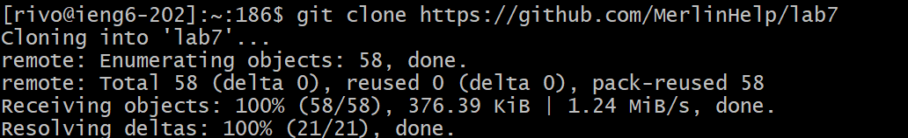
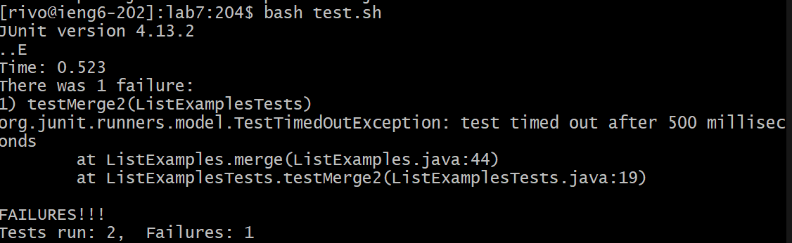
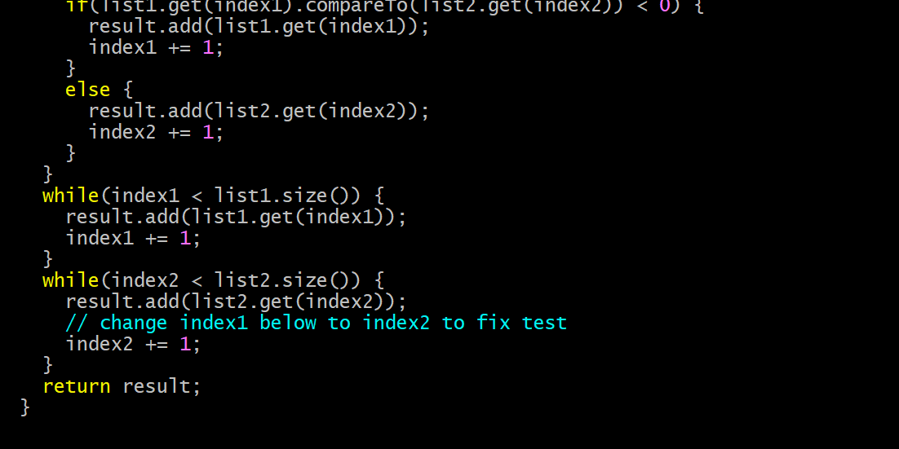
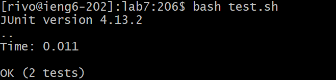
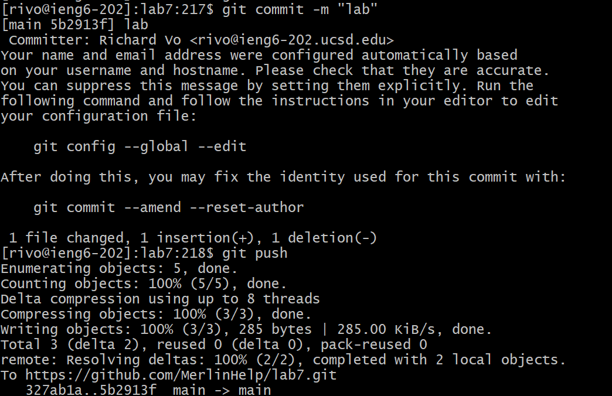

Name: **Richard Vo** 
PID: **A17907078**

# Lab Report Week 7

## Step 4: Log into ieng6

Keys pressed: `ssh<Spacebar>rivo@ieng6-203.ucsd.edu<Enter>yes<Enter>`, I had to ssh and then press yes 
in order to confirm I wanted to login

## Step 5: Clone your fork of the repository from your Github account (using the SSH URL)

Keys pressed: `git clone<Spacebar><Shift><Insert><Enter>` I had to shift insert to fast paste the link of the repo
Then, `cd<Spacebar>la<Tab><Enter>` to autofill and enter lab7

## Step 6: Run the tests, demonstrating that they fail

Keys pressed: `bash test.sh` because I was using the bash script to run my tests

## Step 7: Edit the code file to fix the failing test

Keys pressed: `/index1<Enter><n><n><n><n><n><n><n><n><n>` in order to get to the needed occurence of index1.
Then `<e><r>2` in order to go to the 1 of index1 and then replace it with 2.
Finally `<Esc>:wq!<Enter>` to go into normal mode write and quit

## Step 8:Run the tests, demonstrating that they now succeed

Keys pressed: `<Up><Up><Enter>` because I was going back up to `javac -cp .:lib/hamcrest-core-1.3.jar:lib/junit-4.13.2.jar *.java`. Then `<Up><Up><Enter>` because I was going back up to `java -cp .:lib/hamcrest-core-1.3.jar:lib/junit-4.13.2.jar org.junit.runner.JUnitCore ListExamplesTest`
## Step 9: Commit and push the resulting change to your Github account (you can pick any commit message!)

Keys pressed: `git add .<Enter>` in order to prepare current changes in dir to be commited, `git commit -m "lab"<Enter>` to commit the changes with the "lab" message
Then `git push<Enter>` to push
