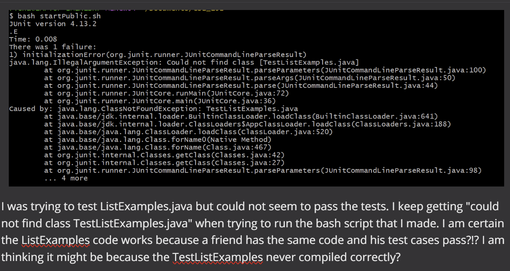
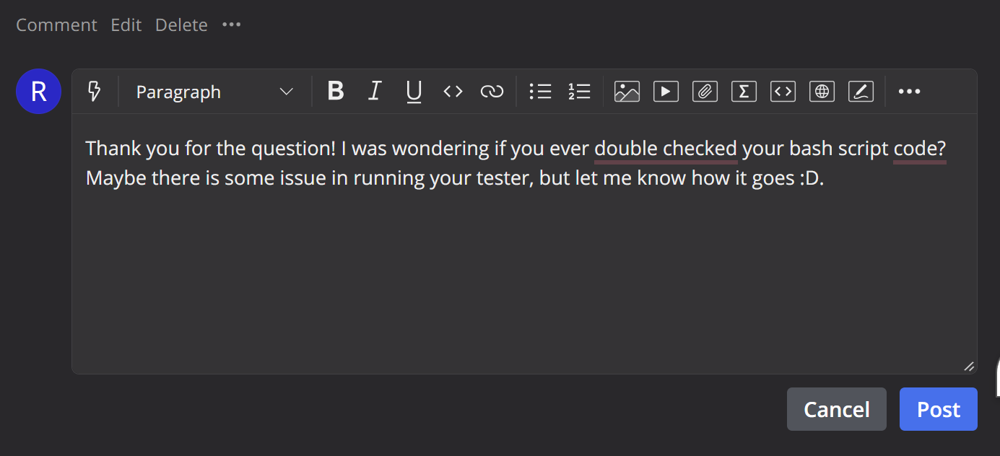
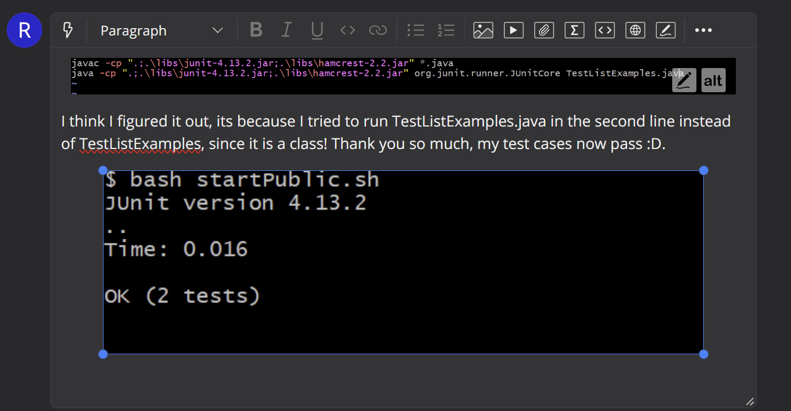

Name: **Richard Vo** 
PID: **A17907078**

# Lab Report Week 9

## Part 1: Debugging Scenario




### Directory Structure:
```
- CSE_15L/ 
    - libs/
        - hamcrest-2.2.jar  
        - junit-4.13.2.jar
    - ListExamples.java
    - TestListExamples.java
    - startPublic.sh
```
### File Content @BEFORE:
* ListExamples.java


```
import java.util.ArrayList;
import java.util.List;

interface StringChecker { boolean checkString(String s); }

class ListExamples {

  // Returns a new list that has all the elements of the input list for which
  // the StringChecker returns true, and not the elements that return false, in
  // the same order they appeared in the input list;
  static List<String> filter(List<String> list, StringChecker sc) {
    List<String> result = new ArrayList<>();
    for(String s: list) {
      if(sc.checkString(s)) {
        result.add(s);
      }
    }
    return result;
  }


  // Takes two sorted list of strings (so "a" appears before "b" and so on),
  // and return a new list that has all the strings in both list in sorted order.
  static List<String> merge(List<String> list1, List<String> list2) {
    List<String> result = new ArrayList<>();
    int index1 = 0, index2 = 0;
    while(index1 < list1.size() && index2 < list2.size()) {
      if(list1.get(index1).compareTo(list2.get(index2)) < 0) {
        result.add(list1.get(index1));
        index1 += 1;
      }
      else {
        result.add(list2.get(index2));
        index2 += 1;
      }
    }
    while(index1 < list1.size()) {
      result.add(list1.get(index1));
      index1 += 1;
    }
    while(index2 < list2.size()) {
      result.add(list2.get(index2));
      index2 += 1;
    }
    return result;
  }
```

* TestListExamples.java


```
import static org.junit.Assert.*;
import org.junit.*;
import java.util.Arrays;
import java.util.List;

class IsMoon implements StringChecker {
  public boolean checkString(String s) {
    return s.equalsIgnoreCase("moon");
  }
}

public class TestListExamples {
  @Test(timeout = 500)
  public void testMergeRightEnd() {
    List<String> left = Arrays.asList("a", "b", "c");
    List<String> right = Arrays.asList("a", "d");
    List<String> merged = ListExamples.merge(left, right);
    List<String> expected = Arrays.asList("a", "a", "b", "c", "d");
    assertEquals(expected, merged);
  }

  @Test(timeout = 500)
  public void testFilter() {
    List<String> myList = Arrays.asList("facts", "factsamous");
    IsMoon myStringChecker = new IsMoon();
    List<String> filtered = ListExamples.filter(myList, myStringChecker);
  }
}
```

* startPublic.sh


```
javac -cp ".;.\libs\junit-4.13.2.jar;.\libs\hamcrest-2.2.jar" *.java
java -cp ".;.\libs\junit-4.13.2.jar;.\libs\hamcrest-2.2.jar" org.junit.runner.JUnitCore TestListExamples.java
```

### Full command line to trigger bug:
I ran: `bash startPublic.sh` in Git Bash while in the `CSE_15L` directory as listed earlier.
### Description of bug fix:
Change the `startPublic.sh` file:
* `vim startPublic.sh` 
* Change `TestListExamples.java` and get rid of the .java (`TestListExamples`) to ensure you're running using the class file instead of the java file
* `<Slash>.java<Enter><n><d2w><Esc>:wq!`

## Part 2: Reflection
### Programming related
* Where to start, there was so much in this course that made me comfortable 
doing things like bash scripting<br> or debugging using jdb or vim (which I thought i would never use)
* Working with directory/file structures made me very comfortable with working in terminal <br>
which seems more productive for my programming (just by knowing how to use terminal)
* I learned how useful bash scripting is especially for running my own testers, now that we need <br>
to put file paths to use librarys (like JUnit). Making an autograder was also a pretty fun/challenging idea 
### Other 
* I learned how to work together in peer programming, while learning to exchange ideas and concerns effectively
* You can use git commit --amend --no-edit to change the last commit using your newest stagest changes <br>
while also not having to change the last commit message. Or just git commit --amend -m "Insert Message" to change the last commit message.<br>
&ensp;&ensp;&ensp;&ensp;I thank a random classmate in my lab for teaching me this git commit option
